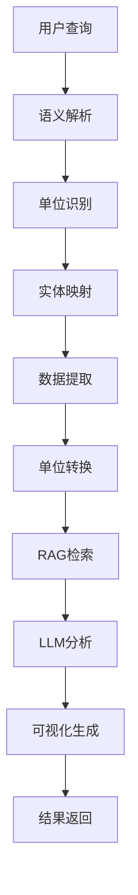

# 表格数据可视化问答AI Agent - 项目结构

## 📁 项目目录结构

```
table-agent/
├── 📄 README.md                    # 项目说明文档
├── 📄 requirements.txt             # Python依赖包
├── 📄 config.py                    # 配置文件
├── 📄 run.py                       # 启动脚本
├── 📄 start.sh                     # 快速启动脚本
├── 📄 app.py                       # FastAPI Web应用
├── 📄 table_agent.py               # 主AI Agent类
├── 📄 example_usage.py             # 使用示例
├── 📄 unit_demo.py                 # 单位识别演示
├── 📄 env_example.txt              # 环境配置示例
├── 📄 PROJECT_STRUCTURE.md         # 项目结构说明
│
├── 📁 core/                        # 核心模块
│   ├── 📄 semantic_parser.py       # 语义解析模块
│   ├── 📄 synonym_mapper.py        # 同义词映射模块
│   ├── 📄 data_extractor.py       # 数据提取模块
│   ├── 📄 rag_engine.py           # 混合RAG引擎
│   ├── 📄 llm_integration.py      # LLM集成模块
│   ├── 📄 visualization_engine.py  # 可视化引擎
│   └── 📄 unit_recognizer.py      # 单位识别模块
│
├── 📁 templates/                   # Web模板
│   └── 📄 index.html              # 主页面模板
│
├── 📁 static/                     # 静态文件
├── 📁 data/                       # 数据目录
├── 📁 logs/                       # 日志目录
├── 📁 uploads/                    # 上传文件目录
└── 📁 reports/                    # 分析报告目录
```

## 🔧 核心组件说明

### 1. 语义解析模块 (`core/semantic_parser.py`)
- **功能**: 识别查询中的关键实体和条件
- **特性**: 
  - 支持中英文实体识别
  - 智能条件提取（数值、文本、时间条件）
  - 意图识别（分析、对比、趋势等）
  - 可视化需求识别
  - **单位识别**: 自动识别查询中的单位信息

### 2. 同义词映射模块 (`core/synonym_mapper.py`)
- **功能**: 将自然语言实体映射到表格列名
- **特性**:
  - 精确匹配、同义词匹配、模糊匹配
  - 语义相似度匹配
  - 自定义同义词扩展
  - 多语言支持

### 3. 数据提取模块 (`core/data_extractor.py`)
- **功能**: 根据查询条件筛选表格数据
- **特性**:
  - 支持多种文件格式（CSV、XLSX、JSON等）
  - 智能数据过滤
  - 统计摘要生成
  - 异常值检测
  - 数据质量评估

### 4. 混合RAG引擎 (`core/rag_engine.py`)
- **功能**: 结合关键词检索和向量检索
- **特性**:
  - TF-IDF关键词检索
  - 向量语义检索
  - 混合融合策略
  - 上下文生成
  - 数据模式分析

### 5. LLM集成模块 (`core/llm_integration.py`)
- **功能**: 大语言模型集成和提示词工程
- **特性**:
  - OpenAI GPT模型集成
  - 专业提示词模板
  - 分析报告生成
  - 可视化建议
  - 对比分析

### 6. 可视化引擎 (`core/visualization_engine.py`)
- **功能**: 生成各种类型的图表
- **特性**:
  - 支持多种图表类型（直方图、散点图、柱状图等）
  - 自动图表推荐
  - 交互式图表（Plotly）
  - 统计信息标注
  - 中文字体支持

### 7. 单位识别模块 (`core/unit_recognizer.py`) ⭐ **新增**
- **功能**: 识别和处理数据中的单位信息
- **特性**:
  - 支持多种单位类型（温度、压力、浓度、质量、体积、长度、时间）
  - 智能单位提取
  - 单位转换功能
  - 单位标准化
  - 数据质量建议

## 🚀 主要功能特性

### 智能语义理解
- ✅ 自然语言查询解析
- ✅ 实体和条件识别
- ✅ 意图识别
- ✅ **单位识别和转换** ⭐
- ✅ 多语言支持

### 数据处理能力
- ✅ 多格式文件支持
- ✅ 智能数据过滤
- ✅ 统计分析和洞察
- ✅ 异常值检测
- ✅ 数据质量评估

### 可视化功能
- ✅ 自动图表推荐
- ✅ 多种图表类型
- ✅ 交互式可视化
- ✅ 统计信息标注
- ✅ 专业图表样式

### AI分析能力
- ✅ 混合RAG检索
- ✅ 智能回答生成
- ✅ 专业分析报告
- ✅ 趋势识别
- ✅ 相关性分析

## 🔄 工作流程



## 📊 支持的查询类型

### 基础查询
- "分析温度分布"
- "比较不同材料的性能"
- "显示异常值"

### 条件查询
- "显示温度大于30°C的数据"
- "分析压力在1.5 bar到2.0 bar之间的记录"
- "比较浓度为1.0 M和2.0 M的差异"

### 可视化查询
- "绘制温度和压力的散点图"
- "生成材料性能的柱状图"
- "显示时间序列趋势图"

### 单位相关查询 ⭐ **新增**
- "分析温度大于30°C的数据分布"
- "显示压力在1.5 bar到2.0 bar之间的记录"
- "比较浓度为1.0 M和2.0 M的性能差异"
- "绘制体积为200 mL到400 mL的散点图"

## 🛠️ 技术栈

### 后端技术
- **Python 3.8+**: 主要编程语言
- **FastAPI**: Web框架
- **Pandas**: 数据处理
- **NumPy**: 数值计算
- **Matplotlib/Seaborn**: 静态可视化
- **Plotly**: 交互式可视化

### AI/ML技术
- **OpenAI GPT**: 大语言模型
- **Sentence Transformers**: 文本嵌入
- **spaCy**: 自然语言处理
- **ChromaDB**: 向量数据库
- **scikit-learn**: 机器学习

### 数据处理
- **TF-IDF**: 关键词检索
- **余弦相似度**: 语义匹配
- **统计方法**: 数据分析
- **正则表达式**: 模式匹配

## 🎯 使用场景

### 科研数据分析
- 实验数据处理
- 结果可视化
- 统计分析
- 报告生成

### 工业数据分析
- 生产过程监控
- 质量控制分析
- 性能评估
- 趋势预测

### 商业智能
- 销售数据分析
- 市场趋势分析
- 客户行为分析
- 决策支持

## 🔧 配置说明

### 环境变量
```bash
# OpenAI API配置
OPENAI_API_KEY=your_api_key_here
OPENAI_MODEL=gpt-4

# 向量数据库配置
VECTOR_DB_PATH=./data/vector_db
EMBEDDING_MODEL=sentence-transformers/all-MiniLM-L6-v2

# 数据处理配置
MAX_ROWS=10000
SUPPORTED_FORMATS=.csv,.xlsx,.xls,.json
```

### 单位配置
系统内置了丰富的单位支持：
- **温度**: °C, °F, K, 度
- **压力**: Pa, kPa, MPa, bar, atm, mmHg, psi
- **浓度**: M, mol, g/L, mg/L, ppm, ppb, %
- **质量**: g, kg, mg, lb, oz, t
- **体积**: mL, L, cm³, m³, gal
- **长度**: mm, cm, m, km, in, ft
- **时间**: s, min, h, d, w, mon, y

## 📈 性能优化

### 数据处理优化
- 分块处理大数据集
- 内存使用优化
- 并行处理支持

### 检索优化
- 向量索引优化
- 缓存机制
- 结果排序优化

### 可视化优化
- 图表渲染优化
- 交互性能优化
- 内存管理

## 🔒 安全考虑

### 数据安全
- 本地数据处理
- 敏感信息保护
- 访问控制

### API安全
- 请求验证
- 错误处理
- 日志记录

## 🚀 部署说明

### 本地部署
```bash
# 1. 安装依赖
pip install -r requirements.txt

# 2. 配置环境
cp env_example.txt .env
# 编辑.env文件

# 3. 启动应用
python run.py
```

### Docker部署
```bash
# 构建镜像
docker build -t table-agent .

# 运行容器
docker run -p 8000:8000 table-agent
```

## 📝 开发指南

### 添加新功能
1. 在`core/`目录下创建新模块
2. 在`table_agent.py`中集成
3. 更新API接口
4. 添加测试用例

### 扩展单位支持
1. 在`unit_recognizer.py`中添加新模式
2. 更新转换系数
3. 测试新单位识别

### 自定义可视化
1. 在`visualization_engine.py`中添加新图表类型
2. 更新图表推荐逻辑
3. 测试新图表功能

---

**这个AI Agent系统现在具备了完整的单位识别和处理能力，能够智能理解包含单位的查询，并进行相应的数据转换和分析！** 🎉


